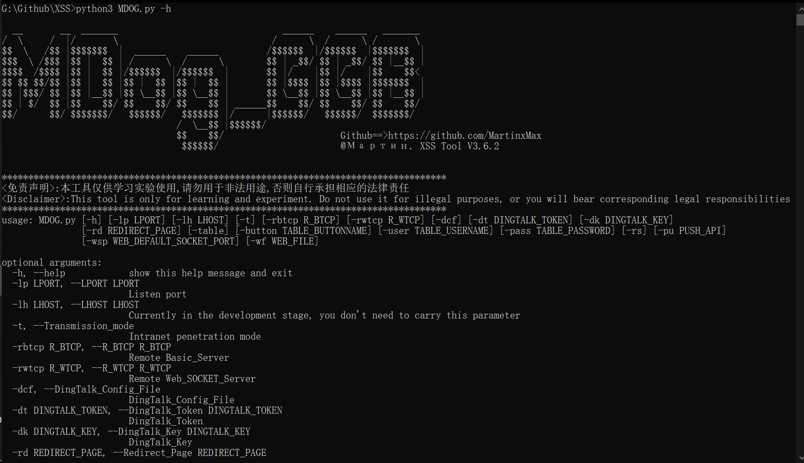
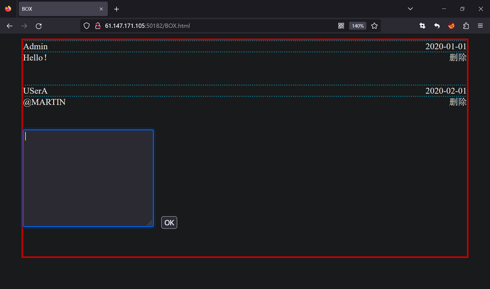
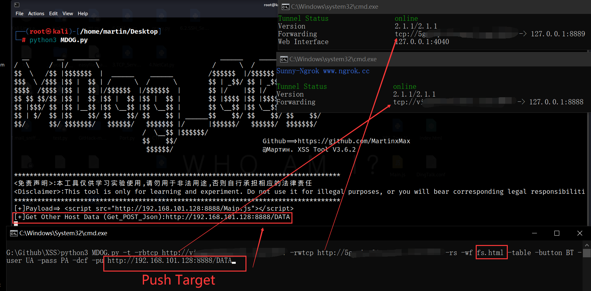
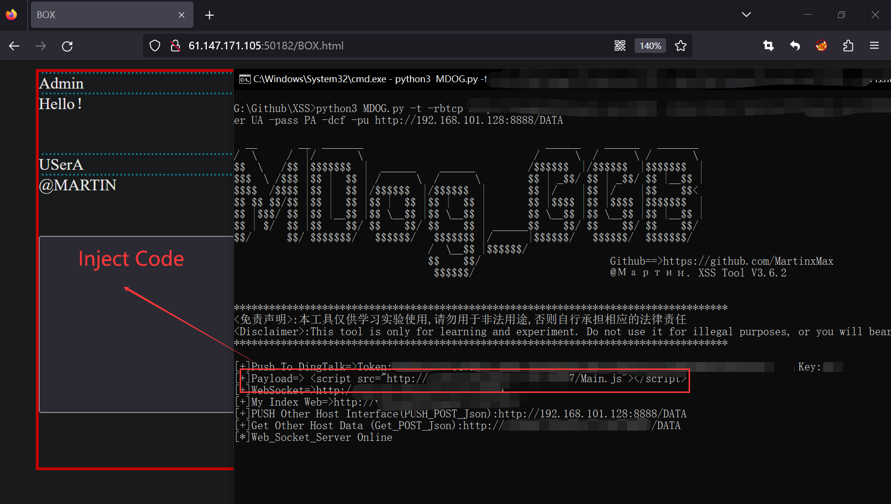
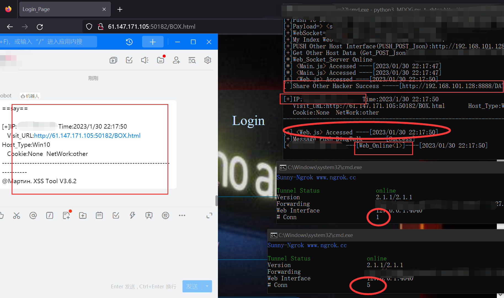
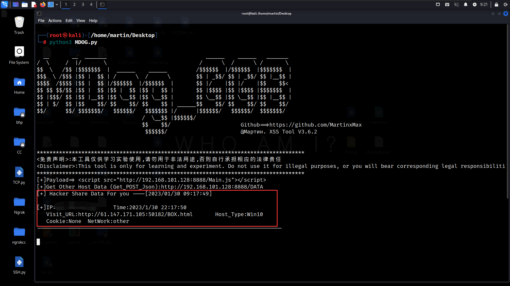
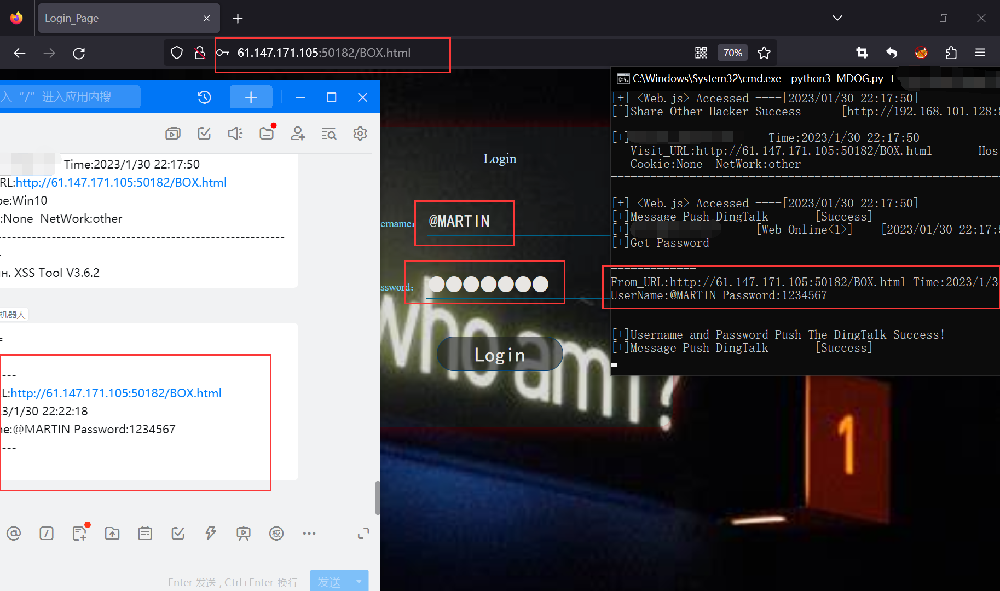

  <div align="center">
 
 <p align="center">
 
 
 
  
 
 
 </p>
  
  <a href="https://www.murphysec.com/accept?code=7851aba9e54808485ea75df92e7a14bf&type=1&from=2&t=2" alt="Security Status"></a>
  
  
  
   
 <table>
  <tr>
      <th>Function</th>
  </tr>
  <tr>
    <th>Obtain the victim's public IP address(Update logging)</th>
  </tr>
  <tr>
    <th>Get administrator cookies(Update logging)</th>
  </tr>
  <tr>
    <th>Page Redirection(Update logging)</th>
  </tr>
  <tr>
    <th>Host data sharing(Update logging)</th>
  </tr>

  <tr>
    <th>DingTalk data sharing</th>
  </tr>
  <tr>
    <th>Remote phishing page deployment(Update logging)</th>
  </tr>
 </table>
</div>

## usage method
  * View help information

      ```#python3 MDOG.py -h```

    

# Advanced attack
* Cookie theft (There are no cookies here) and remote deployment of phishing pages

1.Target Web

   

2.Fill in parameters for remote deployment phishing page

(Linux will act as the shared data party, and win will act as the shared data party and push the data)

```python3 %s -t -rbtcp (Ngrok TCP Tunnel)  -rwtcp (Ngrok TCP Tunnel) -rs -wf fs.html -table -button BT -user UA -pass PA```

 

3.Inject Code

 

4.When anyone visits this page, the cookies and public IP will be disclosed

Win

 

Linux

 

First, we will get the basic information, and then wait for the victim to enter the account password, because the URL of the other party has not changed, which can greatly improve the probability of successful phishing

 


